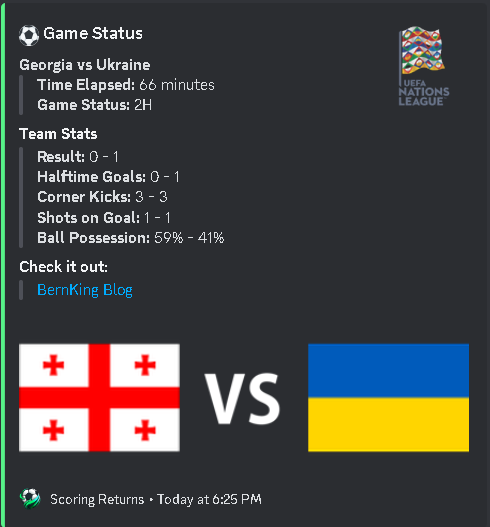
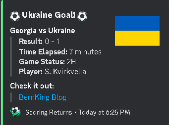
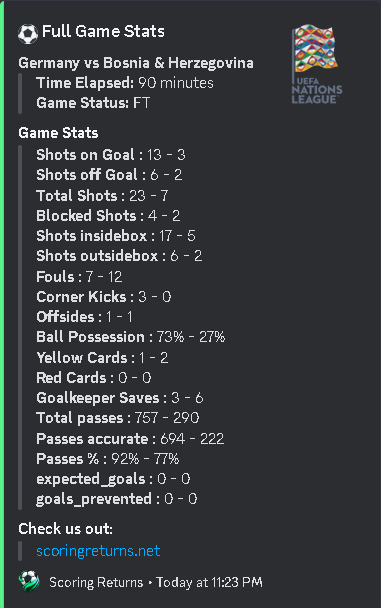
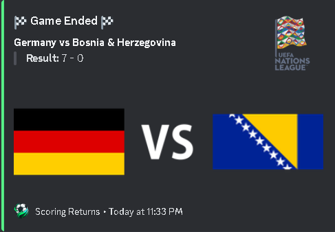
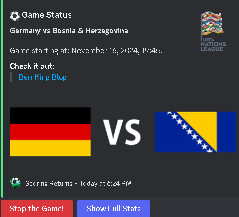

<div align="center">
  <h1>Football Live Score Discord Bot</h1>
  <br/>
  
  <p><i>A powerful Discord bot that tracks live football matches and provides real-time updates, statistics, and events, similar to popular sports platforms like FlashScore and LiveScore. <br/>Created by <a href="https://x.com/bernKing20">@bernKing20</a>.</i></p>
  <br />
</div>

## Overview

This Discord bot provides comprehensive real-time football match tracking, delivering instant updates just like major sports platforms. It monitors matches continuously, sending immediate notifications for key events and maintaining live statistics throughout the game.

## Features
- Live match tracking with real-time updates (similar to FotMob/LiveScore)
- Instant notifications for:
  - Goals
  - VAR decisions
  - Red/Yellow cards
  - Match events (kickoff, half-time, full-time, extra time)
- Detailed match statistics including:
  - Possession
  - Shots (on/off target)
  - Corner kicks
  - Fouls and offsides
  - And many more match stats
- Team schedules and upcoming matches
- Multiple match following capability
- Customizable appearance and behavior

## Dependencies
See `requirements.txt` for a complete list of dependencies.

## Setup
1. Clone the repository:
   ```bash
   git clone https://github.com/YourUsername/football-live-score-bot.git
   cd football-live-score-bot
   ```

2. Install dependencies:
   ```bash
   pip install -r requirements.txt
   ```

3. Copy `.env.example` to `.env` and fill in:
   - `BOT_TOKEN` - Your Discord bot token
   - `RAPIDAPI_KEY` - Your API-Football key

4. Configure `configs/config.py` with your preferences:
   - Customize embed colors, icons, and branding
   - Set maximum simultaneous games
   - Define tracked league IDs from [API-Football dashboard](https://dashboard.api-football.com/soccer/ids)
   - Modify footer text and website links

5. Run setup scripts:
   ```bash
   python scripts/setup_directories.py
   python scripts/league_status_checker.py
   ```

6. Start the bot:
   ```bash
   python bot/main.py
   ```

## Commands
- `/follow` - Follow a live match
- `/next_game` - Get team's next scheduled game
- `/current_games` - View your followed games
- `/ping` - Check if the bot is online

## Full Write-Up
For a detailed explanation of the project, visit the full write-up at [my blog](https://bernking.xyz/projects/football-bot).

## Disclaimer
This bot uses the API-Football service. Make sure you comply with their terms of service and have appropriate API access.

## Featured Images

<div align="center">
  
  
  
  
  
</div>

## License
This project is licensed under the MIT License. See the [LICENSE](LICENSE) file for details.

## Acknowledgements
- [API-Football](https://www.api-football.com/) for the football data API
- [Pycord](https://github.com/Pycord-Development/pycord) - A modern, feature-rich Discord API wrapper for Python
